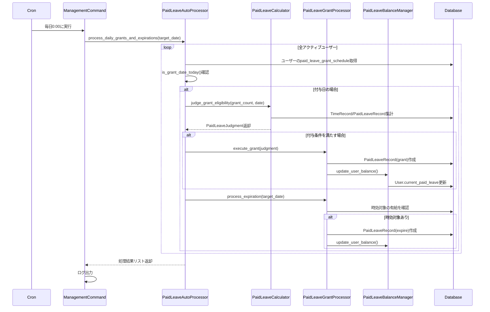
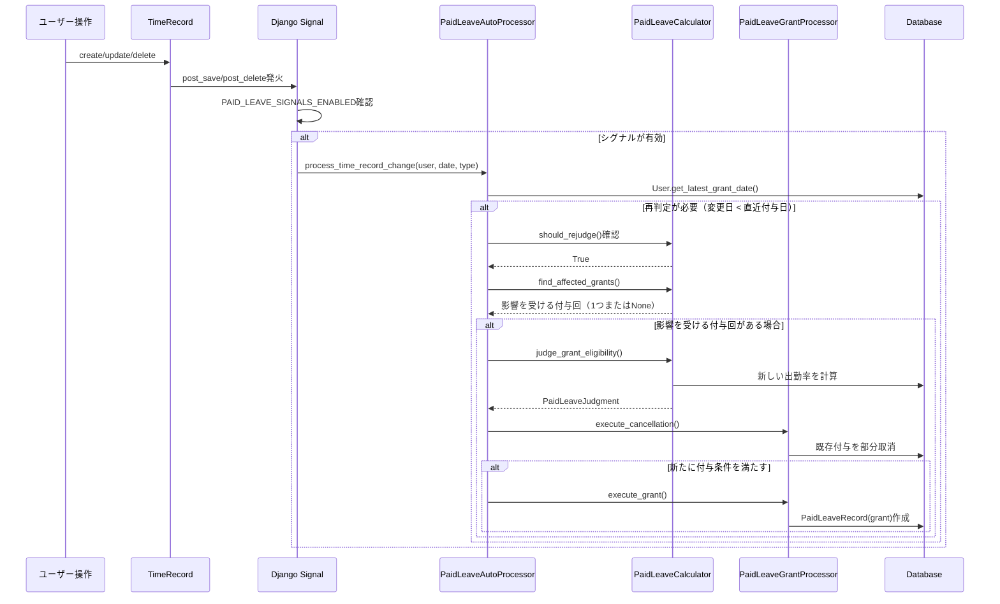
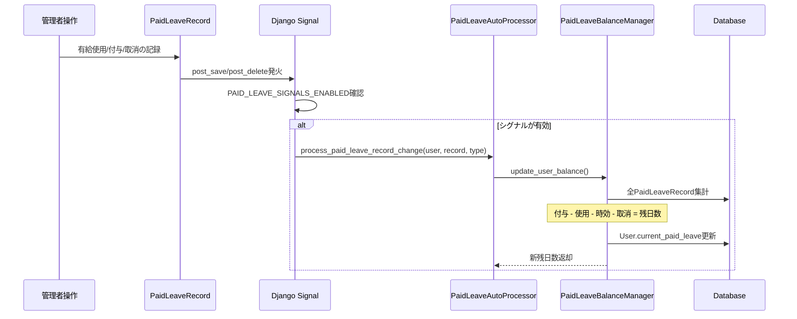
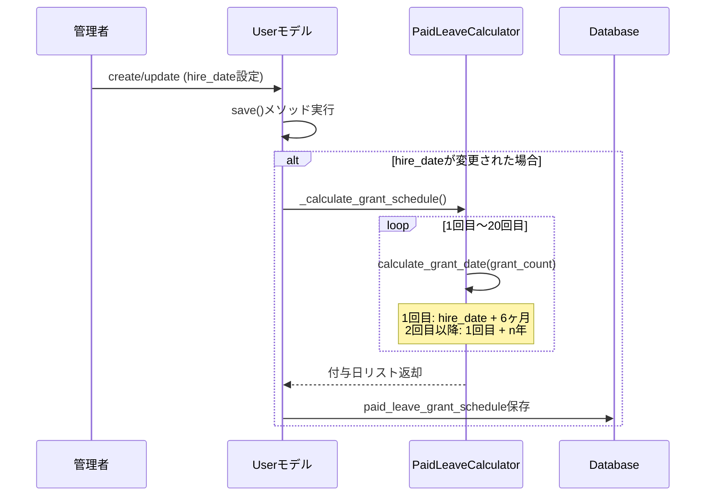
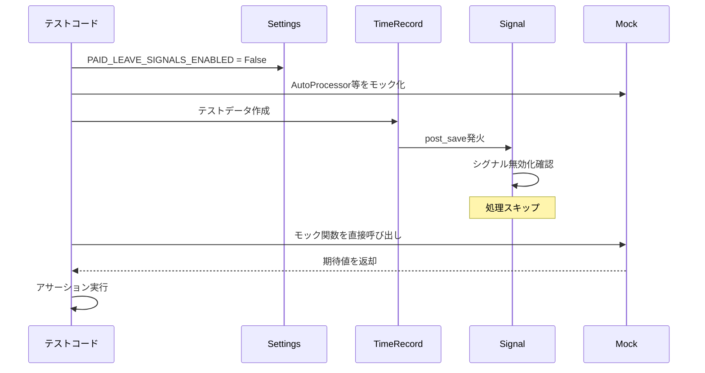

# 有給休暇付与システム - 関数設計

## 概要

有給休暇付与システムで実装すべき関数とクラスの設計を定義します。テストコードではこれらの関数を呼び出してテストを行います。

### 1. 実現すること
- その日が付与日のユーザーの有給休暇付与の判定と付与を行う
- 次の付与日がいつで、それまでにあと何日出勤すれば有給休暇が何日付与されるのかをユーザーに知らせる
- 有給休暇の付与、使用、時効、削除を管理し、計算した残日数をユーザーモデルに保存する
- 有給休暇の付与、取消があった際にユーザーモデルの残日数を更新、修正する
- 通常ではない手動での打刻記録の保存、変更、削除があった際に、影響のある付与日の有給休暇付与判定と付与をやり直す

### 2. 具体的な実現方法
- ./timeclock/services:有給休暇付与判定や付与を実現するためのメソッドを定義
- cron処理:有給休暇付与の判定と付与を実現するためのコマンドを./timeclock/management/commandsに定義し、デプロイ先であるRenderのcron処理を用いて1日1回の付与判定と付与を自動的に実行
- ./timeclock/signals
    - 有給休暇の付与、変更、時効、削除があった際に自動で発火し、ユーザーモデルの残日数を更新、修正する
    - 通常ではない手動での打刻記録の保存、変更、削除があった際に自動で発火し、影響のある付与日の判定、付与をやり直す（付与した有給を取り消す際にはPaidLeaveRecordのdaysを変更することで実現する）

---

## アーキテクチャ設計

### コア機能の分離と責任分担

システム全体を以下の4つのコア機能に分離し、それぞれに特化したクラスを設計します：

1. **PaidLeaveCalculator**: 純粋な計算処理（付与日、出勤率、判定）
2. **PaidLeaveBalanceManager**: 残日数管理と更新処理
3. **PaidLeaveGrantProcessor**: 付与・取消の実行処理
4. **PaidLeaveAutoProcessor**: 自動処理とシグナル連携

### データフローとプロセス設計

```
[TimeRecord/PaidLeaveRecord変更] 
    ↓ (Django Signal)
[PaidLeaveAutoProcessor] 
    ↓ (再判定判断)
[PaidLeaveCalculator] (計算処理)
    ↓ (判定結果)
[PaidLeaveGrantProcessor] (付与実行/取消処理)
    ↓ (残日数影響)
[PaidLeaveBalanceManager] (残日数更新)
    ↓ 
[User.current_paid_leave更新]
```

---

## クラス設計

### PaidLeaveCalculator クラス

有給休暇に関する純粋な計算処理を担当するクラス

#### コンストラクタ
```python
def __init__(self, user):
    """
    Args:
        user: Userモデルのインスタンス
    """
```

#### 付与日計算メソッド

```python
def calculate_grant_date(self, grant_count: int) -> date:
    """
    指定回数目の付与日を計算
    
    Args:
        grant_count: 付与回数（1回目、2回目...）
        
    Returns:
        date: 付与日
        
    Rules:
        - 1回目：入社日の6か月後
        - 2回目以降：1回目付与日のn年後
        - 月単位計算、存在しない日は月末に調整
    """
```

```python
def calculate_judgment_period(self, grant_count: int) -> tuple[date, date]:
    """
    判定対象期間を計算
    
    Args:
        grant_count: 付与回数
        
    Returns:
        tuple[date, date]: (開始日, 終了日)
        
    Rules:
        - 1回目：入社日 〜 付与日前日
        - 2回目以降：前回付与日 〜 今回付与日前日
    """
```

```python
def get_next_grant_info(self, reference_date: date = None) -> 'NextGrantInfo':
    """
    次回付与情報を取得（ユーザー向け情報表示用）
    
    Args:
        reference_date: 基準日（Noneの場合は今日）
        
    Returns:
        NextGrantInfo: 次回付与の詳細情報
        
    Rules:
        - 次回付与日、必要出勤日数、予定付与日数を計算
        - 現在の出勤状況も含める
    """
```

#### 出勤率計算メソッド

```python
def calculate_required_work_days(self, start_date: date, end_date: date) -> int:
    """
    所定労働日数を計算
    
    Args:
        start_date: 期間開始日
        end_date: 期間終了日
        
    Returns:
        int: 所定労働日数（小数点以下切り捨て）
        
    Rules:
        - 計算式：(期間日数 ÷ 7) × 週所定労働日数
        - 小数点以下切り捨て
    """
```

```python
def calculate_attendance(self, start_date: date, end_date: date) -> tuple[int, float]:
    """
    出勤日数を計算（実出勤 + 有給取得）
    出勤率を計算（出勤日数/所定労働日数）

    Args:
        start_date: 期間開始日
        end_date: 期間終了日
          
    Returns:
        tuple[int, float]: (出勤日数, 出勤率（0.0〜1.0）)
          
    Rules:
        - 実出勤日数 + 有給休暇取得日数
        - 出勤率 = 出勤日数 ÷ 所定労働日数

    Raises:
        ValueError: start_dateよりend_dateが過去の場合
    """
```

#### 付与判定メソッド

```python
def determine_grant_days(self, grant_count: int, weekly_work_days: int) -> int:
    """
    付与日数を決定
    
    Args:
        grant_count: 付与回数
        weekly_work_days: 週所定労働日数
        
    Returns:
        int: 付与日数
        
    Rules:
        - 勤続年数と週所定労働日数から付与日数テーブルを参照
        - 週5日以上は通常労働者テーブル
        - 週4日以下は比例付与テーブル
    """
```

```python
def judge_grant_eligibility(self, grant_count: int) -> 'PaidLeaveJudgment':
    """
    付与可否を総合判定
    
    Args:
        grant_count: 付与回数
        
    Returns:
        PaidLeaveJudgment: 判定結果
        
    Rules:
        - 在籍状況チェック
        - 出勤率80%以上チェック
        - 判定日は判定期間の翌日として自動計算
        - その他必要条件のチェック
    """
```

#### 再判定関連メソッド

```python
def should_rejudge(self, modified_record_date: date, modification_date: date) -> bool:
    """
    再判定が必要かを判断
    
    Args:
        modified_record_date: 修正された記録の日付
        modification_date: 修正が行われた日
        
    Returns:
        bool: 再判定が必要な場合True
        
    Rules:
        - 修正された記録の日付が直近付与日より過去の場合に再判定
        - ルール文書の再判定例に準拠
    """
```

```python
def find_affected_grants(self, modified_record_date: date) -> Optional[int]:
    """
    修正により影響を受ける付与回を特定
    
    Args:
        modified_record_date: 修正された記録の日付
        
    Returns:
        Optional[int]: 影響を受ける付与回（影響がない場合はNone）
        
    Rules:
        - 修正された記録の日付が判定対象期間に含まれる付与回を特定
        - 複数の期間に該当する場合は最も直近の付与回を返す
    """
```

#### 有効期限関連メソッド

```python
def calculate_expiry_date(self, grant_date: date) -> date:
    """
    有効期限を計算
    
    Args:
        grant_date: 付与日
        
    Returns:
        date: 有効期限（付与日から2年後）
        
    Rules:
        - 付与日から2年後の同日
        - 存在しない日は月末に調整
    """
```

---

### PaidLeaveBalanceManager クラス

有給残日数の管理と更新処理を担当

```python
def __init__(self, user):
    """
    Args:
        user: Userモデルのインスタンス
    """
```

```python
def get_current_balance(self) -> int:
    """
    現在の有給残日数を計算
    
    Returns:
        int: 現在の有給残日数
        
    Rules:
        - データベースから最新の有給残日数を計算
        - 付与記録・使用記録・時効記録・取消記録を考慮
    """
```

```python
def get_detailed_balance_info(self) -> 'DetailedBalanceInfo':
    """
    詳細な残日数情報を取得
    
    Returns:
        DetailedBalanceInfo: 付与年度別の残日数詳細
        
    Rules:
        - 各付与年度の残日数を計算
        - 時効が近い順に並べる
    """
```

```python
def update_user_balance(self) -> int:
    """
    ユーザーモデルの残日数を最新値に更新
    
    Returns:
        int: 更新後の残日数
        
    Rules:
        - 計算した残日数をuser.current_paid_leaveに保存
    """
```

```python
def calculate_partial_cancellation(self, target_cancel_days: int, target_date: date) -> tuple[int, int]:
    """
    部分取消の計算（残日数がマイナスにならない範囲で取消）
    cancellationのPaidLeaveRecordを作成
    
    Args:
        target_cancel_days: 取消したい日数
        target_date: 取り消しを行う有給のgrant_date
        
    Returns:
        tuple[int, int]: (実際の取消日数, 取消後の残日数)
        
    Rules:
        - 残日数がマイナスにならない範囲で取消
        - actual_cancellation = min(target_cancel_days, current_balance)
        - remaining_after = current_balance - actual_cancellation
        - cancellationのPaidLeaveRecordを作成
    """
```

---

### PaidLeaveGrantProcessor クラス

付与・取消の実行処理を担当

```python
def __init__(self, user):
    """
    Args:
        user: Userモデルのインスタンス
    """
```

```python
def execute_grant(self, judgment: 'PaidLeaveJudgment') -> 'PaidLeaveRecord':
    """
    付与処理を実行
    
    Args:
        judgment: 付与判定結果
        
    Returns:
        PaidLeaveRecord: 作成された付与記録
        
    Rules:
        - 判定結果に基づいてPaidLeaveRecordを作成
        - 残日数の更新も実行
    """
```

```python
def execute_cancellation(self, target_date: date, cancellation_days: int) -> List[PaidLeaveRecord]:
    """
    付与取消処理を実行（部分取消対応）
    
    Args:
        target_date: 取消対象の付与日
        cancellation_days: 取消日数
        
    Returns:
        List[PaidLeaveRecord]: 編集された付与記録のリスト
        
    Rules:
        - 指定付与日の付与記録の付与日数を削減することで取消
        - 残日数がマイナスにならない範囲でのみ取消
        - 複数の付与記録がある場合は古い順に取消処理
    """
```

---

### PaidLeaveAutoProcessor クラス

自動処理とシグナル連携を担当

```python
def __init__(self):
    """自動処理クラスのコンストラクタ"""
```

```python
def process_daily_grants_and_expirations(self, target_date: date) -> list['PaidLeaveJudgment']:
    """
    指定日の全ユーザー付与処理と時効処理
    
    Args:
        target_date: 処理対象日
        
    Returns:
        list[PaidLeaveJudgment]: 全ユーザーの判定結果
        
    Rules:
        - 全ユーザーのpaid_leave_grant_scheduleフィールドを参照
        - target_dateが付与日に含まれるユーザーのみを対象に付与処理を実行
        - 同時に時効消滅処理も実行
        - cron処理から呼び出される
    """
```

```python
def process_time_record_change(self, user, record_date: date, change_type: str) -> list['PaidLeaveJudgment']:
    """
    TimeRecord変更に伴う自動再判定処理
    
    Args:
        user: 対象ユーザー
        record_date: 変更されたレコードの日付
        change_type: 変更タイプ ('create', 'update', 'delete')
        
    Returns:
        list[PaidLeaveJudgment]: 再判定結果のリスト
        
    Rules:
        - 変化があったTimeRecordのtimestampの日付がユーザーの直近の付与日以前の場合のみ処理
        - paid_leave_grant_scheduleフィールドから直近付与日を取得して判定
        - 再判定要否を判断し、影響を受ける付与回の再判定を実行
        - シグナルから呼び出される
    """
```

```python
def process_paid_leave_record_change(self, user, record: 'PaidLeaveRecord', change_type: str) -> None:
    """
    PaidLeaveRecord変更に伴う残日数更新処理
    
    Args:
        user: 対象ユーザー
        record: 変更されたPaidLeaveRecord
        change_type: 変更タイプ ('create', 'update', 'delete')
        
    Rules:
        - 有給使用・付与・取消記録の変更を検知
        - 残日数の再計算と更新を実行
        - シグナルから呼び出される
    """
```

```python
def _execute_rejudgment(self, user, modified_record_date: date) -> List['PaidLeaveJudgment']:
    """
    再判定処理を実行（内部メソッド）
    
    Args:
        user: 対象ユーザー
        modified_record_date: 修正されたレコードの日付
        
    Returns:
        List[PaidLeaveJudgment]: 再判定結果のリスト
        
    Rules:
        - 影響を受ける付与回を特定し、該当する付与を取消・再付与
        - トランザクション管理で整合性を保証
        - 内部メソッドとしてprocess_time_record_changeから呼び出される
    """
```

```python
def _calculate_grant_count_for_date(self, user, target_date: date) -> Optional[int]:
    """
    指定日に対応する付与回数を計算（内部メソッド）
    
    Args:
        user: 対象ユーザー
        target_date: 処理対象日
        
    Returns:
        Optional[int]: 付与回数（該当しない場合はNone）
        
    Rules:
        - 各付与回の付与日を計算し、target_dateと照合
        - 最大20回まで確認
    """
```

---

## データクラス設計

### PaidLeaveJudgment データクラス

```python
@dataclass
class PaidLeaveJudgment:
    """有給付与判定結果"""
    user: User                    # ユーザー
    grant_count: int              # 付与回数
    judgment_date: date           # 判定日
    period_start: date            # 判定期間開始日
    period_end: date              # 判定期間終了日
    required_work_days: int       # 所定労働日数
    attendance_days: int          # 出勤日数
    attendance_rate: float        # 出勤率
    is_eligible: bool             # 付与可否
    grant_days: int               # 付与日数
    expiry_date: date            # 有効期限
    description: str              # 判定理由
```

### NextGrantInfo データクラス

```python
@dataclass
class NextGrantInfo:
    """次回付与情報（ユーザー向け表示用）"""
    next_grant_date: date         # 次回付与日
    days_until_grant: int         # 付与日まで残り日数
    current_attendance_days: int   # 現時点の出勤日数
    required_attendance_days: int  # 必要出勤日数（80%基準）
    remaining_attendance_needed: int # あと何日出勤が必要か
    expected_grant_days: int      # 予定付与日数
    current_attendance_rate: float # 現時点の出勤率
```

### DetailedBalanceInfo データクラス

```python
@dataclass
class DetailedBalanceInfo:
    """詳細残日数情報"""
    total_balance: int           # 合計残日数
    balance_by_grant_date: list['GrantDateBalance']  # 付与日別残日数
    upcoming_expirations: list['ExpirationInfo']    # 近い時効情報
```

```python
@dataclass
class GrantDateBalance:
    """付与日別残日数"""
    grant_date: date            # 付与日
    original_days: int          # 元の付与日数
    used_days: int              # 使用済み日数
    remaining_days: int         # 残り日数
    expiry_date: date          # 有効期限
    days_until_expiry: int     # 時効まで日数
```

```python
@dataclass
class ExpirationInfo:
    """時効情報"""
    grant_date: date           # 付与日
    expiry_date: date         # 時効日
    remaining_days: int       # 時効対象の残日数
    days_until_expiry: int    # 時効まで日数
```


---

## Userモデル拡張設計

### 付与スケジュール関連メソッド

Userモデルに以下のメソッドを追加して、`paid_leave_grant_schedule`フィールドの操作を担当します。

```python
def get_latest_grant_date(self, reference_date: date = None) -> Optional[date]:
    """
    指定日時点での直近の付与日を取得
    
    Args:
        reference_date: 基準日（Noneの場合は今日）
        
    Returns:
        Optional[date]: 直近の付与日（まだ付与日がない場合はNone）
        
    Rules:
        - self.paid_leave_grant_scheduleから基準日以前の最新付与日を取得
        - シグナル処理での判定に使用
    """
```

```python
def is_grant_date_today(self, target_date: date) -> bool:
    """
    指定日がこのユーザーの付与日かを判定
    
    Args:
        target_date: 判定対象日
        
    Returns:
        bool: 付与日の場合True
        
    Rules:
        - self.paid_leave_grant_scheduleフィールドを参照
        - 日次処理での対象者判定に使用
    """
```

```python
def save(self, *args, **kwargs):
    """
    Userモデルのsaveメソッドをオーバーライド
    
    Rules:
        - hire_dateが変更された場合、paid_leave_grant_scheduleを自動更新
        - 入社日から全ての付与日を計算（1回目〜20回目程度）
        - super().save()を呼び出してデータベースに保存
    """
```

```python
def _calculate_grant_schedule(self) -> list[date]:
    """
    入社日に基づいて付与スケジュールを計算（内部メソッド）
    
    Returns:
        list[date]: 付与日のリスト
        
    Rules:
        - PaidLeaveCalculatorを使用して各回の付与日を計算
        - 1回目〜20回目程度の付与日を事前計算
    """
```

---

## シグナル設計

### TimeRecord変更時のシグナル

```python
@receiver(post_save, sender=TimeRecord)
@receiver(post_delete, sender=TimeRecord)
def handle_time_record_change(sender, instance, **kwargs):
    """
    TimeRecord変更時の自動再判定
    
    処理内容:
        1. 変更されたレコードの日付と対象ユーザーを特定
        2. PaidLeaveAutoProcessorを使用して再判定処理を実行
        3. シグナル無効化フラグをチェック（テスト時等）
    """
```

### PaidLeaveRecord変更時のシグナル

```python
@receiver(post_save, sender=PaidLeaveRecord)
@receiver(post_delete, sender=PaidLeaveRecord)
def handle_paid_leave_record_change(sender, instance, **kwargs):
    """
    PaidLeaveRecord変更時の残日数更新
    
    処理内容:
        1. 有給使用・付与・取消記録の変更を検知
        2. PaidLeaveAutoProcessorを使用して残日数更新処理を実行
        3. シグナル無効化フラグをチェック（テスト時等）
    """
```

---

## 処理フローの詳細

このセクションでは、有給休暇システムが実際にどのように動作するかを、5つの主要なシナリオに分けて説明します。各フローは図解付きで示されており、システムの動作を理解しやすくしています。

### 🎯 フロー概要

#### 📅 1. 日次付与処理（毎日自動実行）
**何が起こる？**: 毎日夜中に、「今日が有給付与日のユーザー」がいないか自動チェックし、条件を満たすユーザーに有給を付与

**実生活の例**: 
- 田中さんが1月1日に入社
- 6ヶ月後の7月1日が初回付与日
- 7月1日の夜中0:00に自動で「田中さんの出勤率は80%以上？」をチェック
- 条件を満たしていれば10日の有給を自動付与

#### 🔄 2. 打刻修正時の再判定（リアルタイム）
**何が起こる？**: 過去の打刻記録を修正した瞬間、その変更が有給付与に影響するかを自動判定し、必要に応じて有給を追加付与または取消

**実生活の例**:
- 田中さんが7月に「出勤率不足で有給付与なし」と判定済み
- 8月に6月の打刻漏れを発見・追加入力
- システムが自動で「あ、これで出勤率80%超えた！」と判定
- 遡って7月1日付けで10日の有給を自動付与

#### 💼 3. 有給使用・管理（手動操作時）
**何が起こる？**: 管理者が有給の使用・付与・取消を手動で行った瞬間、自動でユーザーの残日数を再計算・更新

**実生活の例**:
- 田中さんが「8月15日に有給3日使用」を申請
- 管理者がシステムに「使用記録」を入力
- システムが自動で田中さんの残日数を「10日→7日」に更新

#### 👤 4. 新規ユーザー登録（初期設定）
**何が起こる？**: 新しいユーザーを登録し、入社日を設定した瞬間、今後20回分の有給付与予定日を自動計算・保存

**実生活の例**:
- 佐藤さんが2024年4月1日入社予定でユーザー登録
- システムが自動で計算：「1回目：2024年10月1日、2回目：2025年10月1日...」
- 今後の付与スケジュールが完成

#### 🧪 5. テスト実行時（開発者向け）
**何が起こる？**: テスト実行時は上記の自動処理をすべて停止し、テスト用の偽データで動作確認

**開発時の例**:
- 「シグナル無効化フラグ」をONにしてテスト実行
- 打刻データを作成しても自動処理は動かない
- テスト用の期待値で正常性を確認

---

### 1. 日次付与処理フロー（Cronジョブ実行）

**🕛 実行タイミング**: 毎日深夜0:00（Cronジョブ）
**🎯 目的**: その日が付与日のユーザーに有給休暇を自動付与
**⏱️ 処理時間**: 100名で約30秒〜1分

**処理の流れ**:
1. **対象者検索**: 全ユーザーの付与スケジュールをチェック
2. **付与判定**: 出勤率80%以上かを厳密に計算
3. **有給付与**: 条件を満たすユーザーに規定日数を付与
4. **時効処理**: 同時に2年前の有給の時効消滅もチェック
5. **残日数更新**: ユーザーの画面表示用残日数を最新化



### 2. TimeRecord変更時のシグナル処理フロー

**⚡ 実行タイミング**: 打刻記録の作成・更新・削除の瞬間（リアルタイム）
**🎯 目的**: 過去の打刻修正が有給付与に影響する場合の自動再判定
**⏱️ 処理時間**: 通常1秒以内

**具体的なケース**:
- **打刻追加**: 忘れていた出勤日を後から追加 → 出勤率向上 → 有給追加付与の可能性
- **打刻削除**: 間違った打刻を削除 → 出勤率低下 → 有給取消の可能性
- **打刻修正**: 時刻の修正（有給付与への影響は通常なし）

**処理の流れ**:
1. **変更検知**: システムが打刻の変更を自動検知
2. **影響範囲特定**: 「この変更はいつの有給付与に影響する？」を判定
3. **再計算実行**: 影響のある期間の出勤率を再計算
4. **結果適用**: 追加付与または部分取消を自動実行
5. **残日数更新**: 最新の残日数に更新



### 3. PaidLeaveRecord変更時のシグナル処理フロー

**⚡ 実行タイミング**: 有給の使用・付与・取消記録の作成・更新・削除の瞬間（リアルタイム）
**🎯 目的**: 有給関連の記録変更時に自動で残日数を再計算・更新
**⏱️ 処理時間**: 通常0.5秒以内

**具体的なケース**:
- **有給使用記録**: 「8月15日に3日使用」→ 残日数を3日減算
- **有給付与記録**: 「追加で5日付与」→ 残日数を5日加算
- **有給取消記録**: 「過去の付与10日を取消」→ 残日数を10日減算（ただし、マイナスにはならない）
- **使用記録削除**: 「間違った使用記録を削除」→ 使用分を復活させて残日数増加

**処理の流れ**:
1. **記録変更検知**: システムが有給記録の変更を自動検知
2. **残日数再計算**: 全ての有給記録を集計し直し（付与-使用-時効-取消）
3. **ユーザー情報更新**: ユーザー画面に表示される残日数を最新値に更新
4. **整合性確保**: 残日数がマイナスにならないよう自動調整



### 4. ユーザー作成/更新時の自動処理フロー

**⚡ 実行タイミング**: 新規ユーザー登録時、既存ユーザーの入社日変更時（手動操作）
**🎯 目的**: 入社日に基づいて今後の有給付与スケジュールを事前計算・保存
**⏱️ 処理時間**: 通常0.1秒以内（20回分の付与日計算）

**具体的なケース**:
- **新規ユーザー登録**: 「佐藤さん 2024年4月1日入社」→ 1回目付与日：2024年10月1日、2回目：2025年10月1日...と20回分自動計算
- **入社日変更**: 「田中さんの入社日を1月1日→4月1日に変更」→ 全付与日を再計算し直し
- **付与スケジュール確認**: 管理者が「この人の次回付与日はいつ？」をすぐに確認可能

**処理の流れ**:
1. **入社日変更検知**: ユーザー保存時にhire_dateの変更を自動検知
2. **付与日計算**: 1回目（入社日+6ヶ月）、2回目以降（前回+1年）で20回分計算
3. **スケジュール保存**: 計算結果をpaid_leave_grant_scheduleフィールドに保存
4. **即座に利用可能**: 日次処理やシグナル処理で付与日判定に使用



### 5. 統合テスト実行時の処理フロー

**⚡ 実行タイミング**: テストコード実行時（開発者・CI/CD実行）
**🎯 目的**: 本番環境の自動処理を無効化し、テスト用の制御されたデータで動作確認
**⏱️ 処理時間**: テストケースにより異なる（通常1〜10秒程度）

**具体的なケース**:
- **Unit Test**: 「PaidLeaveCalculatorが正しく計算するか？」→ シグナル無効化して純粋な計算ロジックのみテスト
- **Integration Test**: 「実際のフローが動くか？」→ モック使用で期待値をコントロール
- **Signal Test**: 「シグナルが正しく発火するか？」→ 部分的にシグナルを有効化してテスト

**処理の流れ**:
1. **テスト環境準備**: シグナル無効化、モック設定
2. **テストデータ作成**: 実際のデータベース操作（ただし自動処理は動かない）
3. **期待値制御**: モック使用で予想される結果を設定
4. **動作確認**: アサーションで期待値と実際の結果を比較

**重要な制御ポイント**:
- **PAID_LEAVE_SIGNALS_ENABLED = False**: 全シグナル処理を無効化
- **function._disabled = True**: 特定シグナル関数のみ無効化
- **@patch**: 外部処理をモック化して期待値を制御



### 処理フローの重要ポイント

#### シグナルの連鎖防止
- TimeRecord変更 → 再判定 → PaidLeaveRecord作成 → 残日数更新
- 各段階でエラーハンドリングを実施し、無限ループを防止

#### トランザクション管理
- 付与処理、取消処理は`@transaction.atomic`で保護
- エラー時は自動ロールバック

#### パフォーマンス最適化
- 日次処理は付与日のユーザーのみを対象
- 再判定は影響範囲のみに限定
- バルク処理での効率化

---

## Management Command設計

### 日次付与処理コマンド

#### コマンド概要
```bash
# 基本実行（本日の日付で処理）
python manage.py process_daily_paid_leave_grants

# 指定日での実行
python manage.py process_daily_paid_leave_grants --date 2023-07-01

# DRY-RUN（実際の処理なしで対象者確認のみ）
python manage.py process_daily_paid_leave_grants --date 2023-07-01 --dry-run
```

#### クラス設計
```python
class Command(BaseCommand):
    """日次有給付与処理コマンド（cron実行用）"""
    
    help = '指定日の有給休暇付与処理を実行します'
    
    def add_arguments(self, parser):
        """コマンド引数の定義"""
        parser.add_argument(
            '--date',
            type=str,
            help='処理対象日 (YYYY-MM-DD形式、未指定の場合は今日)',
            default=None
        )
        parser.add_argument(
            '--dry-run',
            action='store_true',
            help='実際の処理は実行せず、対象者のみを表示',
            default=False
        )
        
    def handle(self, *args, **options):
        """
        実行内容:
            1. 引数解析と対象日決定
            2. DRY-RUNモードまたは実際の処理を実行
            3. 詳細な処理結果をログ出力
        """
        
    def _dry_run_check(self, auto_processor, target_date):
        """
        DRY-RUN: 処理対象者をチェック
        
        処理内容:
            - アクティブユーザーの付与スケジュールを確認
            - 指定日が付与日のユーザーをリスト表示
            - 実際の処理は実行しない
        """
        
    def _execute_processing(self, auto_processor, target_date):
        """
        実際の処理を実行
        
        処理内容:
            1. process_daily_grants_and_expirationsを実行
            2. 付与処理結果の詳細表示（成功/失敗件数、対象者詳細）
            3. 時効処理結果の詳細表示（時効ユーザー、消滅日数）
            4. ログ出力とコンソール出力
        """
        
    def _log_expiration_results(self, target_date):
        """
        時効処理の結果をログ出力
        
        処理内容:
            - 指定日に作成された時効記録を集計
            - ユーザー別の時効消滅詳細を表示
            - 総計情報の出力
        """
```

#### 出力例
```bash
# 通常実行の出力例
$ python manage.py process_daily_paid_leave_grants --date 2023-07-01

日次有給付与処理を開始します (対象日: 2023-07-01)
有給付与・時効処理を実行中...
時効処理完了: 2名のユーザーで8日が時効消滅
  ⏰ 田中太郎: 5日時効消滅 (付与日: 2021-07-01)
  ⏰ 佐藤花子: 3日時効消滅 (付与日: 2021-07-01)
付与処理完了: 3件の判定を実行
  付与成功: 2件
  付与失敗: 1件
  ✓ 山田一郎 (Email: yamada@company.com): 10日付与 (出勤率: 85.3%)
  ✓ 鈴木二郎 (Email: suzuki@company.com): 11日付与 (出勤率: 92.1%)
日次有給付与・時効処理が正常に完了しました

# DRY-RUN実行の出力例
$ python manage.py process_daily_paid_leave_grants --date 2023-07-01 --dry-run

日次有給付与処理を開始します (対象日: 2023-07-01)
DRY-RUN モード: 実際の処理は実行されません
付与処理対象ユーザー数: 3
  - 山田一郎 (ID: 1, 入社日: 2023-01-01)
  - 鈴木二郎 (ID: 2, 入社日: 2022-01-01)
  - 田中三郎 (ID: 3, 入社日: 2021-01-01)
```

---

## テストサポート設計

### シグナル制御フラグ

```python
# settings.py または環境変数
PAID_LEAVE_SIGNALS_ENABLED = True  # デフォルトは有効
```

### シグナル無効化機能

```python
class SignalDisabler:
    """
    テスト時にシグナルを無効化するコンテキストマネージャー
    
    Usage:
        with SignalDisabler():
            # この中ではシグナルが動作しない
            TimeRecord.objects.create(...)
    """
    
    def __enter__(self):
        """シグナルを無効化"""
        from django.conf import settings
        self.original_state = getattr(settings, 'PAID_LEAVE_SIGNALS_ENABLED', True)
        settings.PAID_LEAVE_SIGNALS_ENABLED = False
    
    def __exit__(self, exc_type, exc_val, exc_tb):
        """シグナル状態を復元"""
        from django.conf import settings
        settings.PAID_LEAVE_SIGNALS_ENABLED = self.original_state
```

### シグナル関数内でのフラグチェック

```python
@receiver(post_save, sender=TimeRecord)
@receiver(post_delete, sender=TimeRecord)
def handle_time_record_change(sender, instance, **kwargs):
    """
    TimeRecord変更時の自動再判定
    
    処理内容:
        1. シグナル無効化フラグをチェック
        2. 変更されたレコードの日付と対象ユーザーを特定
        3. PaidLeaveAutoProcessorを使用して再判定処理を実行
    """
    from django.conf import settings
    if not getattr(settings, 'PAID_LEAVE_SIGNALS_ENABLED', True):
        return
    
    # 実際の処理を実行...
```

---

## 実装時の注意事項

### エラーハンドリング
- 無効な日付データに対する適切な例外処理
- データベースアクセスエラーの処理
- 境界値（週0日勤務等）の適切な処理

### パフォーマンス考慮
- 大量ユーザーに対する効率的な処理
- データベースクエリの最適化
- 不要な重複計算の回避

### ログ出力
- 判定過程の詳細なログ出力
- エラー発生時のトレーサビリティ確保
- デバッグ用の中間値出力

この設計に基づいてテストコードを修正し、実際の実装を行います。